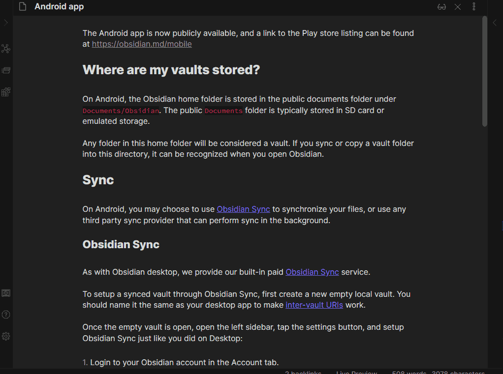

# Obsidian "No Dupe Leaves" plugin

[The discussion that led to this plugin's creation](https://forum.obsidian.md/t/dont-reopen-notes-that-are-already-open-just-put-the-focus-on-them/36488/3).

Obsidian's default behavior is to replace the old note `A` with the new note `B` when you open it,
_even if `B` is already open in another pane_, leading you to have 2 instances of `B`.

This plugin will avoid opening duplicates when possible, while still respecting all "force open in a new pane" instructions (e.g. middle click on a link).

⚠️ **Word of warning** ⚠️ This plugin will globally affect Obsidian's behavior, even for 3rd party plugins.

---

## Contributing

As this is a quick hack over the default behavior, no feature request will be considered. You can submit PRs for bugfixes.
